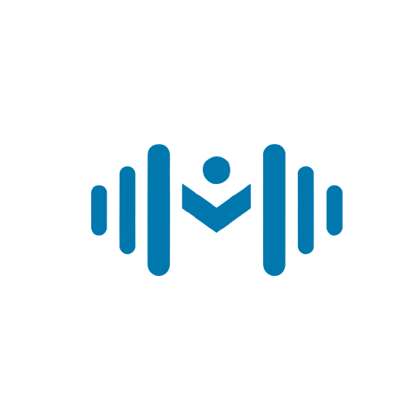

# Momentum

An app that provides the complete gym experience, integrating both personal tracking and
gym support.

- Hosted Demo: [Momentum App](https://guilherme096.github.io/momentum/)

https://uapt33090-my.sharepoint.com/:v:/g/personal/guilherme_rosa60_ua_pt/EdzxUsOnSLNOnHf9VeCNtL4BzYnvMMpgttozC-GkR9rorw?e=0lI1gn&nav=eyJyZWZlcnJhbEluZm8iOnsicmVmZXJyYWxBcHAiOiJTdHJlYW1XZWJBcHAiLCJyZWZlcnJhbFZpZXciOiJTaGFyZURpYWxvZy1MaW5rIiwicmVmZXJyYWxBcHBQbGF0Zm9ybSI6IldlYiIsInJlZmVycmFsTW9kZSI6InZpZXcifX0%3D

## Context

Project developed under the [Human-Computer Interaction](https://www.ua.pt/pt/uc/2484) course
at [University of Aveiro](https://www.ua.pt/).

## Stack

- [React](https://reactjs.org/)
- [Vite](https://vitejs.dev/)
- [Tailwind CSS](https://tailwindcss.com/)
- [DaisyUI](https://daisyui.com/)

## How to run the project

- `npm install`
- `npm run dev`

To expose to the network:

- `vite --host`

## Grade

This project was graded with **18**/20.

## Authors

- [Guilherme Rosa](https://github.com/guilherme096)
- [Henrique Teixeira](https://github.com/henriqueft04)
- [Rui Machado](https://github.com/ruimachado23)
